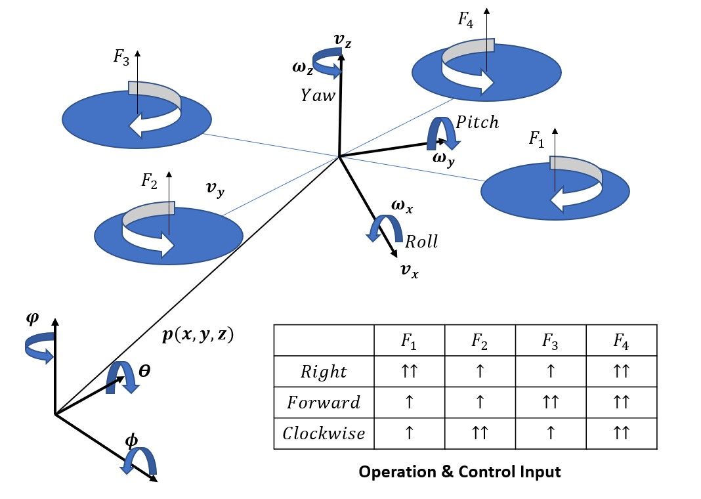
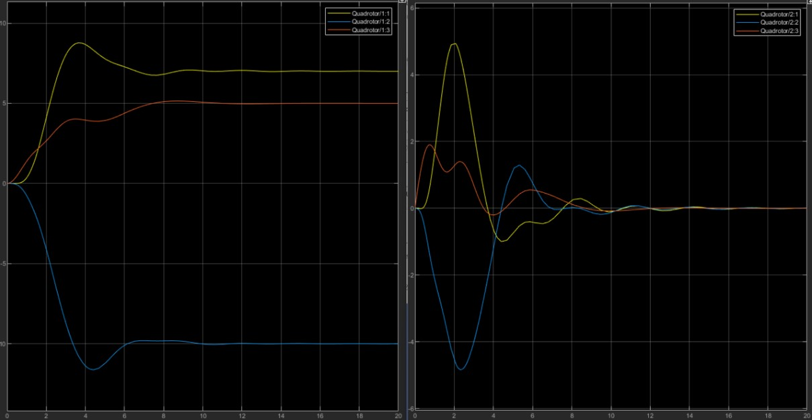

# Quadrotor
</img>
### Dynamics and Controller Simulation - Matlab Simulink 
### Equation Derivation - Python

## Simulation Image
###Control Input- Position(7,-10,5) Heading(1 rad)

</img>
</img>

## I refer to below
  Lim, Jeonggeun. “Autonomous target following and monitoring with collision avoidance based on an Lidar on a multi-copter”
  Yang, Kwangwoong. "쿼드 로터 무인항공기 제어 및 시뮬레이션"

