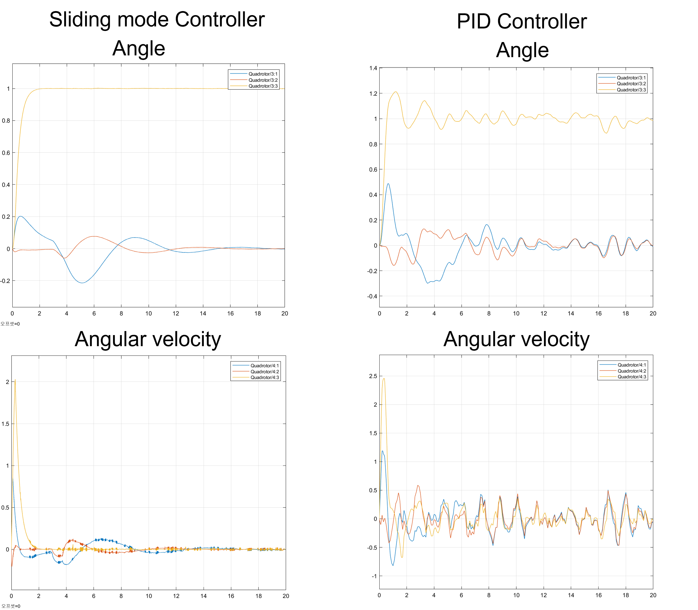
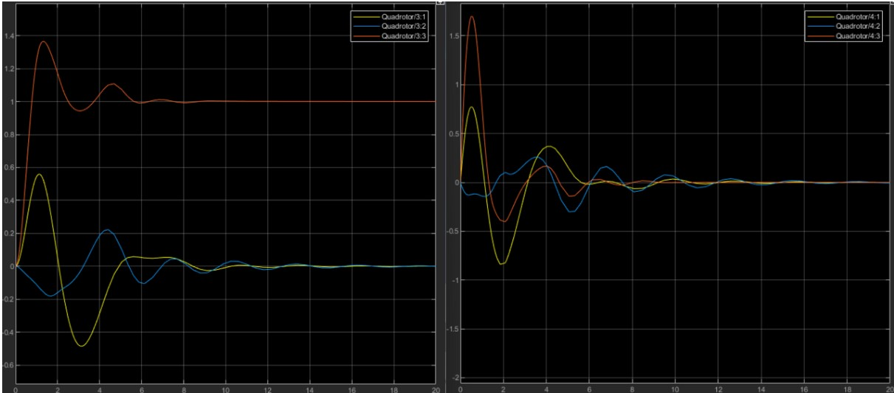

# Quadrotor
</img>
### Dynamics and Controller Simulation - Matlab Simulink 
PID Controller - Quadrotor_Controller.slx 
Sliding Mode Controller - Quadrotor_SMC.slx
### Equation Derivation - Python
Quadrotor_Model.ipynb
## SMC vs PID Simulation in Disturbance situation
</img>
## PID Simulation Image
### Control Input- Position(7,-10,5) Heading(1 rad)

</img>
</img>

## I refer to below
Lim, Jeonggeun. “Autonomous target following and monitoring with collision avoidance based on an Lidar on a multi-copter” 
Yang, Kwangwoong. "쿼드 로터 무인항공기 제어 및 시뮬레이션" 
Khali. "Nonlinear System"

